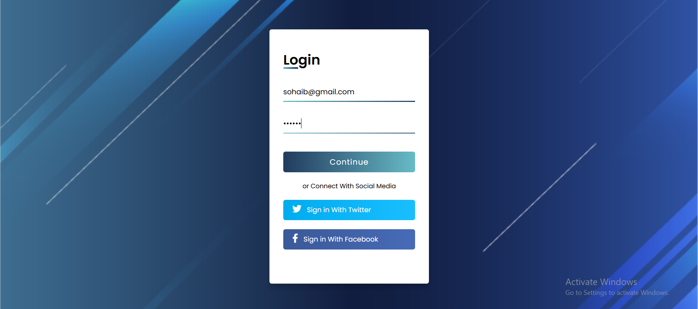
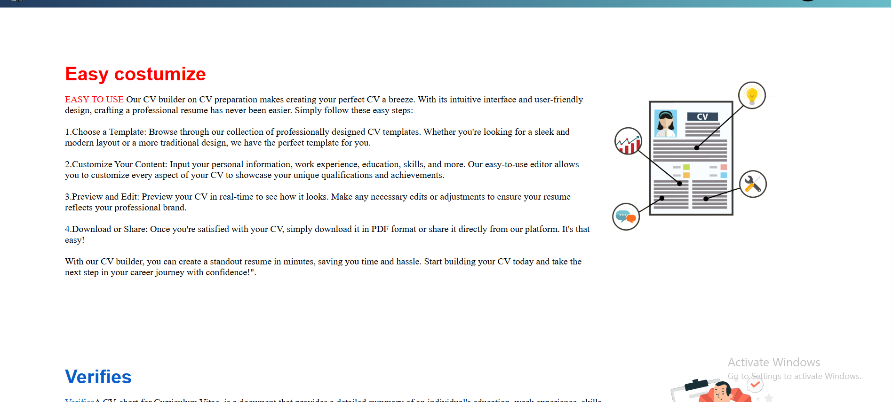
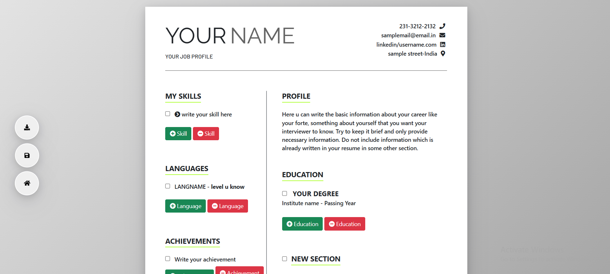

# CV-website

This is an **Simple website for creating CV** that let you choose the CV templete and modify it with your data.

> ✅ **Built by:** Sohaib Raid Rasheed

---

## 📽️ Demo

🖼️ 

(project interface/website interface2.png)

---

## 📖 Description

This project is demo for creating a CV pdf with your data you can use it and modify it or complete it.

---

## 🧰 How It Works

1. **Login** – Put any data it doesn't need to be true.
2. **Main Page** – An interface where descrips the website.
3. **Select a template** – choose any template that suit you.
4. **add information and export it** – add your information and them export the CV as a PDF.

---

## 🛠️ what we used

1. some images to make the design beutiful.
2. HTML.
3. CSS.
4. JavaScript.

---

Don't forgit to give me a ⭐ on this project if you liked it

